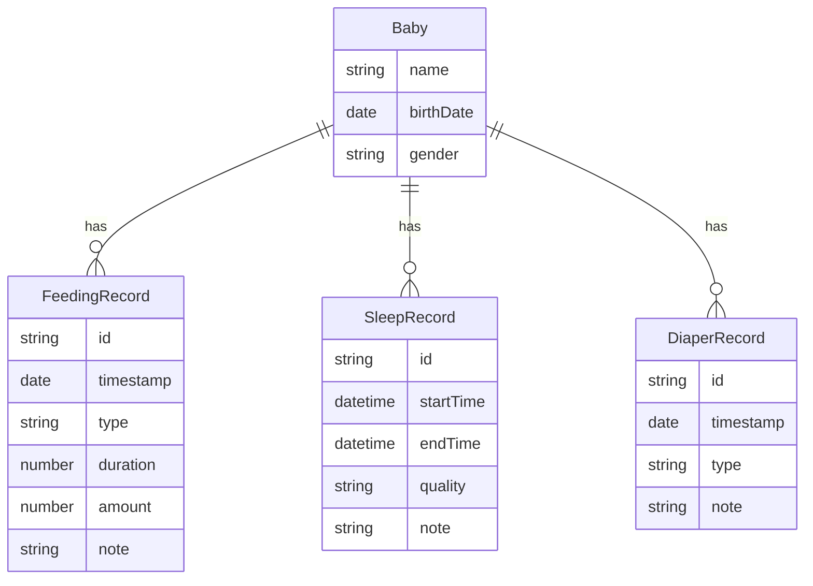

## 1. 架构设计

```mermaid
flowchart TD
    "用户界面 (Vue 3 + TypeScript)" --> "路由层 (Vue Router)"
    "路由层" --> "仪表盘"
    "路由层" --> "喂奶表单"
    "路由层" --> "睡眠表单"
    "路由层" --> "尿布表单"
    "路由层" --> "历史记录"
    "路由层" --> "周报统计"
    "路由层" --> "设置中心"
    "仪表盘" --> "Composables"
    "喂奶表单" --> "Composables"
    "睡眠表单" --> "Composables"
    "尿布表单" --> "Composables"
    "历史记录" --> "Composables"
    "周报统计" --> "Composables"
    "设置中心" --> "Composables"
    "Composables" --> "本地存储 (localStorage)"
    "Composables" --> "模拟数据 (Mock Data)"
```

## 2. 技术说明

- 前端：Vue 3 + TypeScript + Vite + Tailwind CSS
- 初始化工具：vite-init (vue-ts 模板)
- 路由：Vue Router 4
- 后端：无（纯前端，数据存储在 localStorage）
- 数据库：无（使用 localStorage + 模拟数据）

## 3. 路由定义

| 路由 | 用途 |
|------|------|
| `/` | 仪表盘 - 今日概览和快速入口 |
| `/feeding` | 喂奶记录表单 |
| `/sleep` | 睡眠记录表单 |
| `/diaper` | 尿布记录表单 |
| `/history` | 历史记录列表与筛选 |
| `/weekly` | 周报统计图表 |
| `/settings` | 设置中心 |

## 4. 数据模型

### 4.1 数据模型定义



### 4.2 数据类型定义

```typescript
interface Baby {
  name: string
  birthDate: string
  gender: 'male' | 'female'
}

interface FeedingRecord {
  id: string
  timestamp: string
  type: 'breast' | 'formula'
  duration: number
  amount: number
  note: string
}

interface SleepRecord {
  id: string
  startTime: string
  endTime: string
  quality: 'deep' | 'light' | 'fussy'
  note: string
}

interface DiaperRecord {
  id: string
  timestamp: string
  type: 'wet' | 'dirty' | 'mixed'
  note: string
}

type ActivityRecord = FeedingRecord | SleepRecord | DiaperRecord

interface AppSettings {
  darkMode: boolean
  notifications: boolean
}
```

### 4.3 本地存储方案

- `baby-care:baby` — 宝宝基本信息
- `baby-care:feedings` — 喂奶记录数组
- `baby-care:sleeps` — 睡眠记录数组
- `baby-care:diapers` — 尿布记录数组
- `baby-care:settings` — 应用设置

初始化时加载模拟数据覆盖空存储，确保首次打开即可体验完整流程。
